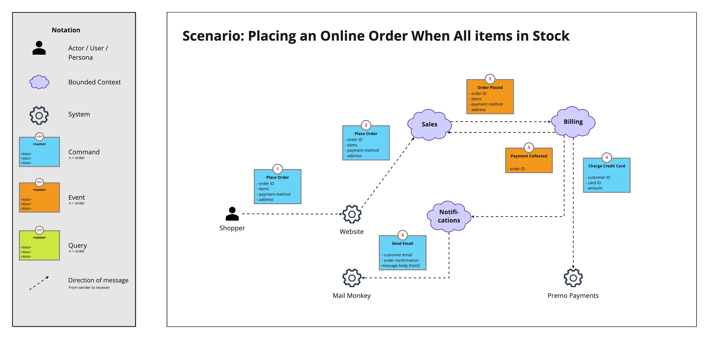

# Domain Message Flow Modelling

Designing loosely-coupled systems requires more than carefully designed boundaries. Carefully defined interactions between bounded contexts is equally important.

A [bounded context](https://martinfowler.com/bliki/BoundedContext.html) is a sub-system in a software architecture aligned to a part of the domain. It can be implemented as a microservice or a module within a monolith.

A Domain Message Flow Diagram is a simple visualisation showing the flow of messages (commands, events, queries) between actors, bounded contexts, and systems, for a single scenario.

## Formats

There are 2 basic formats, but there is no formal specification so adjust the tool to suit your needs if the basic formats don't work for you.

### Separate Message & Contents

The separate message & contents format uses 2 shapes for each message: 1 for the name and order of the message and a separate box to display the contents of the message (the information it carries).

The benefit of this format is that you can focus on the flow of messages without getting bogged down by the message contents at the start.

Start by showing just the messages flowing between senders and receivers (with the order number on the message).

Then show the contents of each message in a separate box next to each message:

### Combined Message & Contents

The combined message & contents format uses a single shape to capture the message name, order, and contents.

This format is good when you want to focus on the contents of each message from the beginning.

## How to Use

When you have an initial cut of your architecture - you have identified candidate bounded contexts - you can begin design the message flows.

Start by creating a list of of scenarios to model. And then for each scenario create a diagram

When creating a diagram, the typical flow is:

1. Start with an actor/context/system
2. Create the message they want to send
3. Add the recipient of the message and a line connecting the sender and the receiver
4. Place the message close to the line
5. Repeat steps 1 - 4 until your scenario is complete

The message should contain 3 elements:

1. The name of the message
2. The significant data contained within the message
3. The order in which the message occurs in the flow being modelled

## Visualisation Tips

The number one problem with Domain Message Flow Diagrams, and diagrams in general, is too much information. [Miller's Law](https://en.wikipedia.org/wiki/Miller%27s_law) is a good heuristic to use here. Aim to have between 5 and 9 messages on your diagram.

If you find that adding the data to each message is breaking your flow of progress, you can defer the data section of each message it until you have placed all of your messages.

## Additional Resources

- [DDD Pattern: Library Contexts](https://medium.com/nick-tune-tech-strategy-blog/ddd-pattern-library-contexts-d6ae81f462ef)
- [Mapper Contexts & Supercontexts: Decoupling Domain-Specific and Domain-Generic Bounded Contexts](https://medium.com/nick-tune-tech-strategy-blog/mapper-contexts-supercontexts-decoupling-domain-specific-and-domain-generic-bounded-contexts-5eb6a1e7c5fc)
- [Gateway Interchange Contexts](https://medium.com/nick-tune-tech-strategy-blog/gateway-interchange-contexts-899696e67848)

## Contributors

Thanks to all [existing and future contributors](https://github.com/ddd-crew/domain-message-flow-modelling/graphs/contributors) and to the following individuals who have all contributed to Domain Message Flow Modelling:

- [Kacper Gunia](https://github.com/cakper)
- [Zsofia Herendi](https://twitter.com/zherendi)
- [Nick Tune](https://github.com/ntcoding)

Domain Message Flow Diagrams are heavily inspired by:

- [Simon Brown's C4 Container Diagrams](https://c4model.com/)
- [Domain Storytelling](https://domainstorytelling.org/)

## Contributions and Feedback

The Domain Message Flow Modelling notation is freely available for you to use. In addition, your feedback and ideas are welcome to improve the technique or to create alternative versions. 

Feel free to also send us a pull request with your examples.

[![CC BY 4.0][cc-by-shield]][cc-by]

This work is licensed under a [Creative Commons Attribution 4.0 International
License][cc-by].

[![CC BY 4.0][cc-by-image]][cc-by]

[cc-by]: http://creativecommons.org/licenses/by/4.0/
[cc-by-image]: https://i.creativecommons.org/l/by/4.0/88x31.png
[cc-by-shield]: https://img.shields.io/badge/License-CC%20BY%204.0-lightgrey.svg
